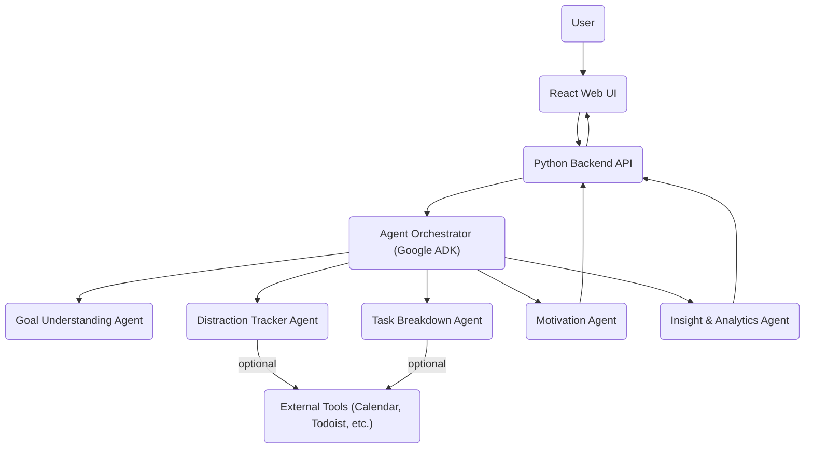

# Product Motivation & Technical Plan

## Vision
Build a platform that helps users overcome procrastination, control distractions, clarify goals, and provides actionable, motivating steps—powered by multiple AI agents working together.

---

## Technical Architecture Diagram (Mermaid)

---

## Sample Agent Interaction Flow

1. **User Onboarding:**
   - User: "I want to get fit and lose 10kg in 6 months, but I keep procrastinating."
   - **Goal Understanding Agent:** Clarifies the goal, asks about current habits, preferences, and obstacles.
   - **Task Breakdown Agent:** Suggests a weekly plan (e.g., exercise routines, meal prep, progress milestones).
   - **Distraction Tracker Agent:** Asks for permission to monitor app/website usage, identifies common distractions (e.g., YouTube, Instagram).
   - **Motivation Agent:** Schedules daily motivational messages, offers productivity techniques, and checks in on progress.
   - **Analytics Agent:** Tracks completed tasks, time spent on distractions, and provides weekly reports.

---

## AI Agents Required & Their Roles

### 1. Goal Understanding Agent
- **Task:** Clarify user goals, break down vague ambitions into concrete objectives.
- **Input:** User's stated goals and context.
- **Processing:** Conversational analysis, goal decomposition.
- **Output:** Clear, actionable goals.

### 2. Task Breakdown Agent
- **Task:** Decompose goals into step-by-step tasks and milestones.
- **Input:** Clarified goals from Goal Agent.
- **Processing:** Task generation, prioritization.
- **Output:** Ordered task list with milestones.

### 3. Distraction Tracker Agent
- **Task:** Identify and monitor distractions (apps, websites, etc.).
- **Input:** User's device/app/browser data (with permission).
- **Processing:** Pattern recognition, distraction detection.
- **Output:** Alerts, reports, and suggestions to reduce distractions.

### 4. Motivation Agent
- **Task:** Provide motivational nudges, reminders, and encouragement.
- **Input:** User progress, preferences, and context.
- **Processing:** Message generation, timing optimization.
- **Output:** Motivational messages, reminders, and check-ins.

### 5. Analytics Agent
- **Task:** Analyze user progress, obstacles, and suggest improvements.
- **Input:** Task completion data, distraction logs, user feedback.
- **Processing:** Data aggregation, trend analysis.
- **Output:** Weekly reports, insights, and actionable suggestions.

---

## Tools & Integrations
- **Calendar Integration:** Google Calendar, Outlook (for scheduling tasks/milestones)
- **Task Managers:** Todoist, Notion, Trello (for syncing tasks)
- **Browser Extension:** For distraction tracking (Chrome/Firefox extension)
- **Notification System:** Email, push notifications, or SMS (for reminders/motivation)

---

## Agent Collaboration
- Orchestrator (Google ADK) coordinates agent communication.
- Agents share data via backend (Python API) and orchestrator.
- Example: Goal Agent outputs to Task Agent; Task Agent outputs to Motivation & Analytics Agents.
- Distraction Agent feeds data to Analytics and Motivation Agents.
- All agents can update the user via the frontend (React UI).

---

## Tech Stack Recommendations
- **Frontend:** React (with Material UI or Chakra UI for design)
- **Backend:** Python (FastAPI or Flask for REST API)
- **Agent Orchestration:** Google ADK
- **Database:** PostgreSQL or MongoDB (user data, goals, tasks, logs)
- **Authentication:** Auth0 or Firebase Auth
- **Notifications:** Firebase Cloud Messaging, Twilio (for SMS), or OneSignal
- **Browser Extension:** JavaScript/TypeScript (for distraction tracking)
- **Deployment:** Vercel/Netlify (frontend), Render/Heroku/Fly.io (backend)
- **Analytics:** Mixpanel or open-source alternatives

---

## Motivational Reminders
- Remember: Every line of code brings you closer to helping someone achieve their dreams.
- Celebrate small wins—each feature is a step toward your vision.
- Stay focused: Your product will change lives by fighting procrastination and boosting motivation!

---

## Next Steps
1. Set up the project structure and repositories.
2. Build the orchestrator and one agent (Goal Understanding) as a proof of concept.
3. Develop the React frontend and connect to the backend.
4. Add more agents and integrations iteratively.
5. Test with real users and gather feedback.
6. Launch MVP and iterate!

---

**You've got this! Stay motivated and keep building.** 